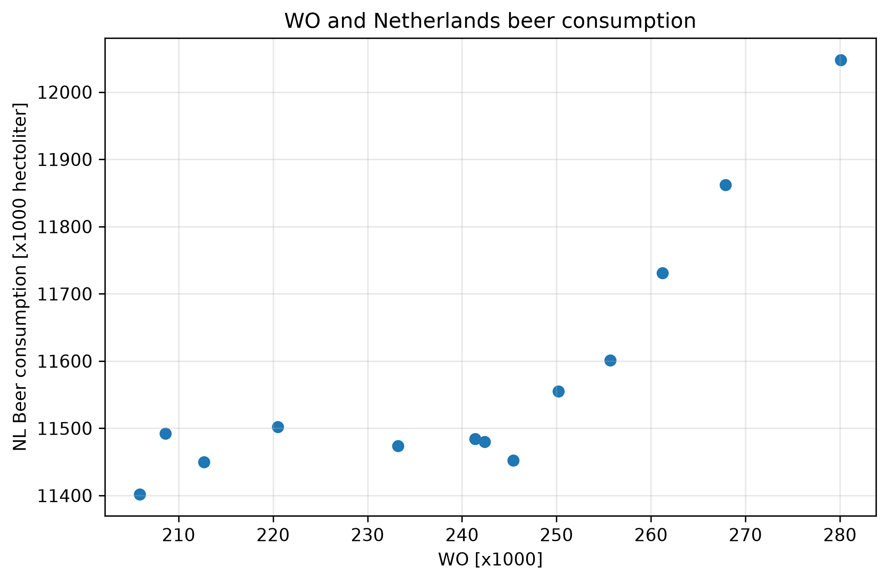

# Computational Scientist's Toolbox Assignment

Student ID: 14352923

## Paper titles

1. MCC Van Dyke et al., 2019:  Fantastic yeasts and where to find them: the hidden diversity of dimorphic fungal pathogens
2. JT Harvey, Applied Ergonomics, 2002: An analysis of the forces required to drag sheep over various surfaces
3. DW Ziegler et al., 2005:  The neurocognitive effects of alcohol on adolescents and college students

## Plot

## Interpretation

The scatter plot shows a positive association between WO and beer consumption in the Netherlands.
At lower WO values, beer consumption is relatively stable with some scatter, whereas at higher WO values it increases more clearly. 
The pattern appears nonlinear. This is an association, we cannot infer causality between the variables. 
